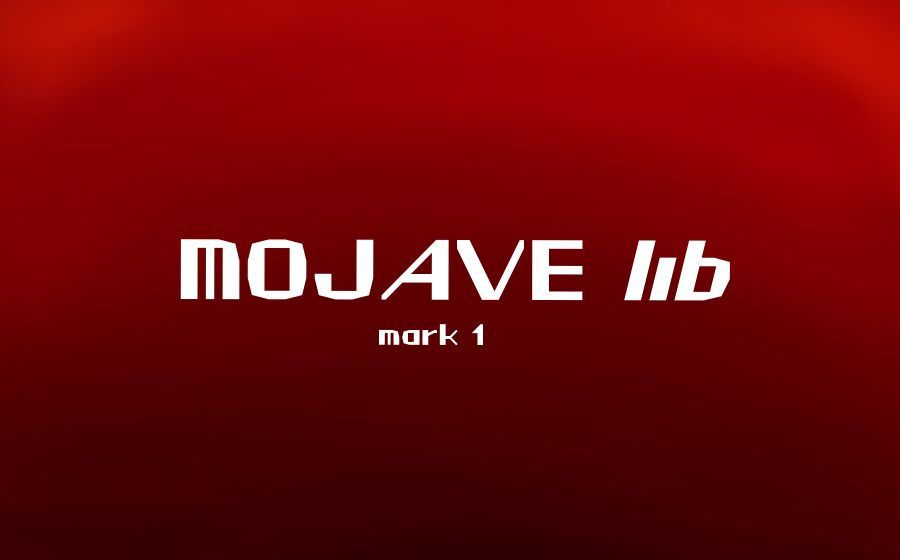
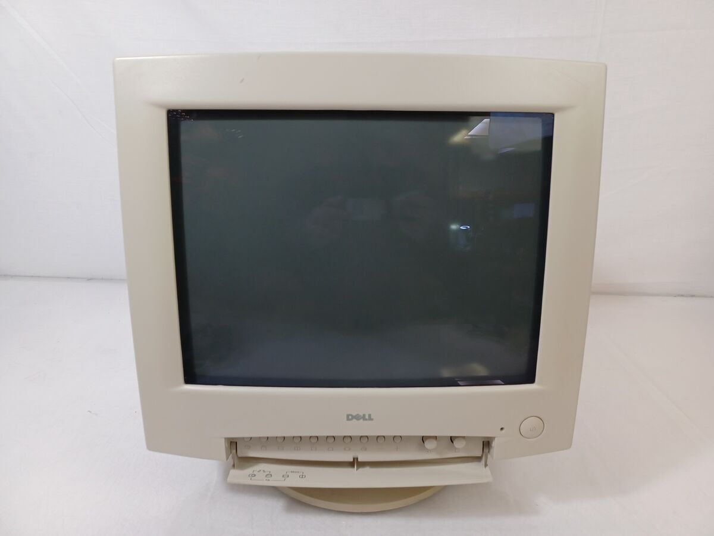
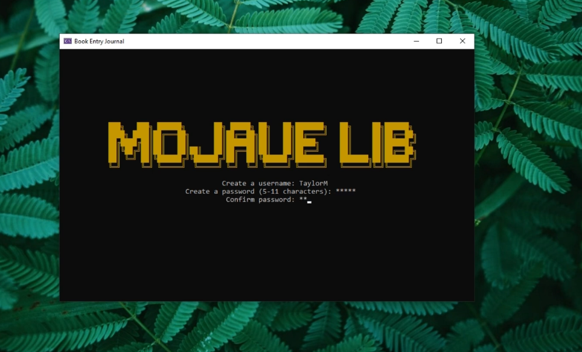
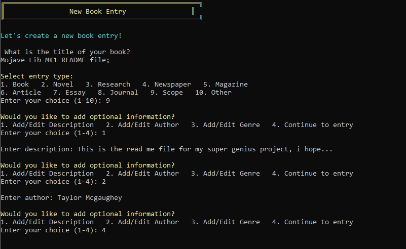
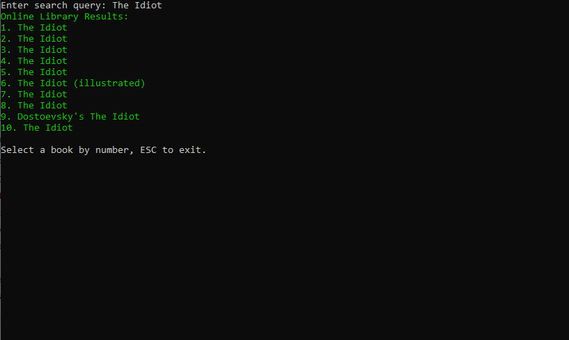

# MojaveLib-Mk1: The All-in-One Study Terminal



**MojaveLib-Mk1** is a .NET Framework console application designed to be a focused, distraction-free environment for study, research, and personal knowledge management. It combines a local journaling system, integration with online book libraries, and a private, offline-capable AI assistant into a single, retro-inspired terminal interface.

## Reclaim Your Focus Back with MojaveLib

In an age of constant digital noise, MojaveLib was born from a desire to create a serene space for deep work. The project's soul lies in its unique pairing of modern software with vintage hardware—a classic Dell CRT monitor. This isn't just for aesthetics; it's a statement. By stripping away the distractions of modern operating systems—the notifications, the multitasking, the endless feeds—we can reconnect with the focused, intentional act of learning and creating.

This project transforms a piece of computing history into a powerful, modern tool, proving that new technology can be thoughtfully integrated to enhance focus rather than shatter it.


## Watch Mojave Do Its Thing.

                                                                       *https://youtu.be/wVSp57sZ7s0*
## Core Features

MojaveLib is built on three pillars designed to support your intellectual journey.

### 1. The Local Journal: Your Private Notebook
Keep a secure, offline journal of your thoughts, book notes, and research.
- **Local-First Storage**: All entries are saved directly to your machine. No clouds, no accounts, no data mining.
- **Rich Metadata**: Tag entries with titles, authors, genres, and descriptions for easy organization.
- **Full CRUD Functionality**: Create, read, update, and delete entries through a simple, intuitive menu system.
- **Secure Access**: Your journal is protected with a username and a hashed password, ensuring your notes remain private.


### 2. Online Library: Your Gateway to Knowledge
Discover and track books from vast digital libraries without leaving the terminal.
- **Seamless Integration**: Connects to external APIs (like Google Books) to search for books on any topic.
- **Bookmarking**: Save books to a personal "to-read" list.
- **Recommended Reading**: Generates a list of recommended books based on your interests.


### 3. AI Topic Explorer: Your Personal Research Assistant
Leverage the power of Large Language Models (LLMs) for in-depth research, right in your terminal.
- **Private and Offline**: Integrates with **Ollama 3:8B**, allowing you to run powerful AI models locally. Your queries never leave your machine.
- **Streaming Output**: Get real-time, character-by-character responses from the AI for an interactive experience.
- **Conversational AI**: Engage in a continuous chat with the AI to explore topics, ask follow-up questions, and refine your understanding.
- **Save AI Insights**: Instantly save AI-generated explanations as new entries in your local journal.


  Hes quite fond of yapping, almost too much...

## Technical Deep Dive

MojaveLib-Mk1 is a well-structured .NET Framework application that demonstrates several advanced C# concepts. The architecture is modular, with manager classes (`EntryManager`, `SettingsManager`, `OnlineBookManager`,`UserManager`) handling specific domains of functionality.

One of the more complex features is the real-time streaming of responses from the local Ollama AI. This is achieved using `HttpClient` with `HttpCompletionOption.ResponseHeadersRead` to process the response stream as it arrives.

Here’s a look at the core streaming logic in `AiAssistant.cs`:

```csharp
// From: MojaveLib/AiAssistant.cs

private static async Task<string> StreamOllamaChatAsync(ChatSession chat, CancellationToken ct)
{
    var payload = BuildOptionsPayload(chat.Model);
    payload["messages"] = chat.ToMessagesArray();
    payload["stream"] = true;

    using (var http = new HttpClient())
    using (var req = new HttpRequestMessage(HttpMethod.Post, $"{chat.BaseUrl.TrimEnd('/')}/api/chat"))
    {
        http.Timeout = TimeSpan.FromMinutes(15);
        req.Content = new StringContent(payload.ToString(), Encoding.UTF8, "application/json");

        using (var resp = await http.SendAsync(req, HttpCompletionOption.ResponseHeadersRead, ct))
        {
            if (!resp.IsSuccessStatusCode)
            {
                var err = await resp.Content.ReadAsStringAsync();
                throw new InvalidOperationException($"Ollama chat stream error {(int)resp.StatusCode}: {err}");
            }

            var sb = new StringBuilder();
            using (var stream = await resp.Content.ReadAsStreamAsync())
            using (var reader = new StreamReader(stream))
            {
                Console.WriteLine(); // new line for streaming
                while (!reader.EndOfStream && !ct.IsCancellationRequested)
                {
                    var line = await reader.ReadLineAsync();
                    if (string.IsNullOrWhiteSpace(line)) continue;

                    JObject json;
                    try { json = JObject.Parse(line); }
                    catch { continue; }

                    var piece = json["message"]?["content"]?.ToString();
                    if (!string.IsNullOrEmpty(piece))
                    {
                        Console.Write(piece); // Stream output directly to the console
                        sb.Append(piece);
                    }

                    var done = json["done"]?.ToObject<bool>() ?? false;
                    if (done) break;
                }
                Console.WriteLine();
            }
            return sb.ToString();
        }
    }
}
```

This method sends a request to the Ollama API and reads the response line by line, parsing the JSON chunks to extract and display the text as it's generated by the model.

## Getting Started

### Prerequisites
- **Windows Operating System**
- **.NET Framework 4.7.2** or later.
- **Visual Studio 2019** or later.
- **Ollama** (for AI features).

### Installation
1.  Clone the repository to your local machine:
    ```bash
    git clone https://github.com/Taylormcg262/MojaveLib-Mk1.git
    ```
2.  Open the `MojaveLibMk1.sln` file in Visual Studio.
3.  Restore the NuGet packages (this should happen automatically, but you can right-click the solution in Solution Explorer and select "Restore NuGet Packages").
4.  Build and run the project.

### Setting Up the AI Assistant (Ollama)
To use the AI Topic Explorer, you need to have Ollama running locally.

1.  **Download and Install Ollama**: Go to [ollama.com](https://ollama.com/) and download the installer for your operating system.

2.  **Pull an AI Model**: Open your terminal or command prompt and pull a model. i recommend `llama3:8b` as it is what i used to run this and it works flawlessly.
    ```bash
    ollama pull llama3:8b
    ```

3.  **Run the Ollama Server**: In most cases, the Ollama server runs automatically in the background after installation. To be sure, you can run:
    ```bash
    ollama serve
    ```
    You should see output indicating the server is listening on `http://localhost:11434`.

4.  **Configure the Application**: The application is pre-configured to connect to `http://localhost:11434` and use the `llama3:8b` model. If your setup is different, you can configure it via the `App.config` file or by setting environment variables:
    - `OLLAMA_BASE_URL`: The URL of your Ollama server.
    - `OLLAMA_MODEL`: The name of the model you want to use.

## The Future: Mark II and Beyond

MojaveLib-Mk1 is just the beginning. The vision extends to a 

**Mark II**—a fully standalone terminal where a single-board computer (like a Raspberry Pi) is embedded directly within the CRT monitor's casing. This would create a self-sufficient, all-in-one device dedicated solely to the art of focused work.

**Mark III** - will have a more defined approach towards the over all aesthetic of the app, with plans to integrate into a GUI application in the future with a design similar to the retro-wave style from the franchise fallout (where i got the idea for this to begin with...)

**MLP** - Mojave Lib Portable....

---

*Welcome to a more focused way of learning.*

```
███╗   ███╗ ██████╗       ██╗ █████╗ ██╗   ██╗███████╗   ██╗     ██╗██████╗
████╗ ████║██╔═══██╗      ██║██╔══██╗██║   ██║██╔════╝   ██║     ██║██╔══██╗
██╔████╔██║██║   ██║      ██║███████║██║   ██║█████╗     ██║     ██║██████╔╝
██║╚██╔╝██║██║   ██║██║   ██║██╔══██║██║   ██║██╔══╝     ██║     ██║██╔══██╗
██║ ╚═╝ ██║╚██████╔╝╚██████╔╝██║  ██║╚██████╔╝███████╗   ███████╗██║██████╔╝
╚═╝     ╚═╝ ╚═════╝  ╚═════╝ ╚═╝  ╚═╝ ╚═════╝ ╚══════╝   ╚══════╝╚═╝╚═════╝
