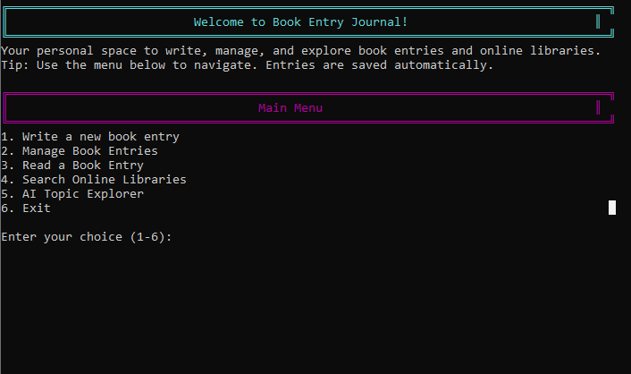

# MojaveLib-Mk1
### The All in One Terminal

This project is a .NET Framework console application, manages local book entries, integrates with external online libraries (Google Books), provides AI-assisted topic explorer connected to local LLM (Ollama).

### Why?
Around October of 2025, i was gifted a Dell D1528-ls 15 Vga Vintage Crt Monitor from a friend as he had no use for it any longer and was going to discard of it, when he offered it to me i had hundreds of ideas immeditately for it, it could be an art project , a coding project, it could have even been furniture at a point! but after a while brainstorming ideas for what i could do with the monitor i ended up on, why not all 3?

I adore the aesthetic and design that comes with monitors of this era as it prompts such a standout / personality in a sense for a screen. so when i was thinking what could i do for this project, i thought well it might be time for this grandfather of a monitor to join todays society and have a new purpose.

### What?
Mojave Lib. Mojave Lib is a study / all around knowledge tool aimed to help people gather their own thoughts and taste within study topics / books and their very own writing cutting out all the middle men distractions like notifications / adverts and games of the sort.

On the Software Side, Mark 1 is a Console application that is able to store and save locally users journal entries, be able to access free distrubuted APIs from online libraries such as GoodReads and Google Books and its very own local and offline accessible AI Topic study aid using the ollama local model. now connecting this to the behometh of a monitor that is sat in my room i had a few extra ideas.

ideas such as just simply connecting a standalone pc via vga to the monitor and having only the software and outer essiental apps installed or embedding a system as the likes of a raspberry pi5 within the monitor to make it a complete stand alone terminal with self sufficient power supply and no need for an external pc.

But thats a different story MojaveLib Mk1 is currently ran on my personal computer connected to the monitor via hdmi to vga cables and only running the software when need be, after all this is just the prototype to evaluate where my understanding of C# lays.

## Here is MojaveLib Mk1.
##### Main Menu

The main menu - a simple switch case that allows the users to select from the various functions that mojave lib offers.
##### Personal Journal Feature

Where the user declares all attributes that match their journal entry
- description - author - genre - media type - the content -

##### Online Libray
##### AI Study Tool
